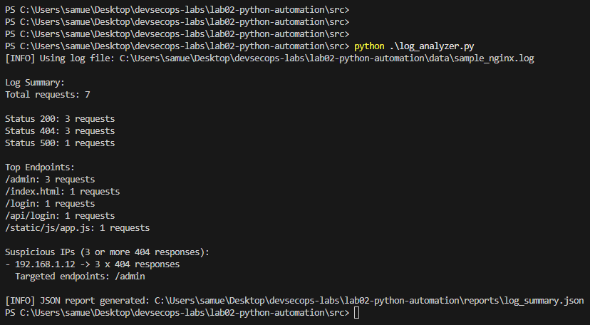
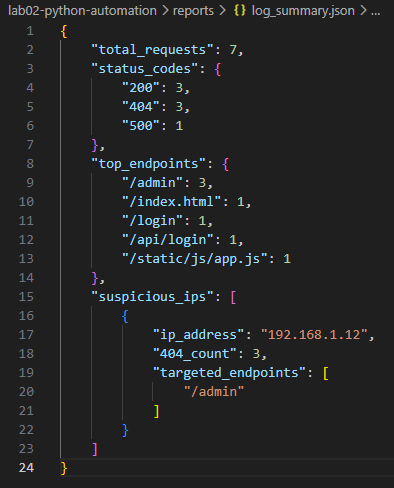

# Lab 02 — Python Log Analysis Automation

This lab demonstrates how to analyze log files using Python in a DevSecOps context.

---

## Objective

- Parse log files
- Extract key data (IP, endpoints, status codes)
- Detect suspicious activity
- Generate a JSON report

---

## Features

- Log parsing (Nginx-style logs)
- HTTP status code analysis
- Endpoint tracking
- Suspicious IP detection (based on repeated 404s)
- JSON report generation

---

## Project Structure

    lab02-python-automation/
    ├── src/
    │   └── log_analyzer.py
    ├── data/
    │   └── sample_nginx.log
    ├── reports/
    │   └── log_summary.json
    ├── evidences/
    ├── documentation.md
    └── README.md

---

## How to Run

    python .\src\log_analyzer.py

---

## Evidences

### Script Execution

### Generated JSON Report

---

## Documentation

For a detailed explanation of the script logic and design decisions, see:

    documentation.md
