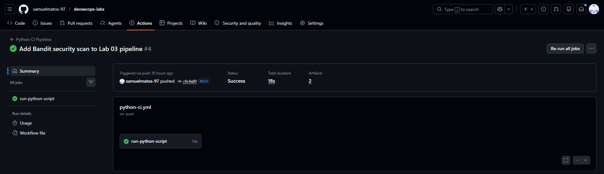
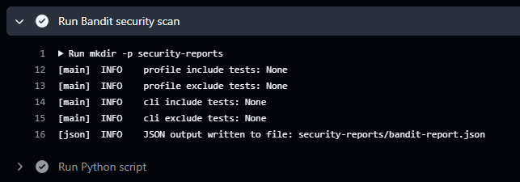
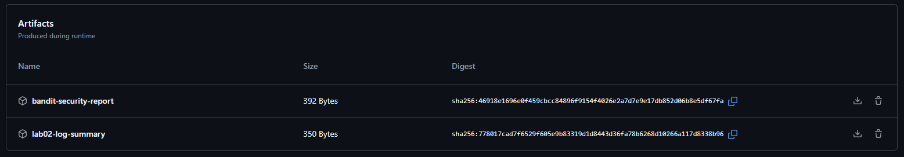

# Lab 03 — CI/CD with GitHub Actions + Security Scanning

This lab introduces Continuous Integration (CI) using GitHub Actions and integrates basic security scanning into the pipeline.

---

## Objective

- Automate execution of the Python script from Lab 02
- Validate that the script runs successfully on every change
- Generate and store artifacts (JSON report)
- Integrate security scanning using Bandit

---

## What This Pipeline Does

On every push or pull request:

1. Checks out the repository
2. Sets up Python environment
3. Runs a security scan (Bandit)
4. Executes the log analysis script
5. Validates that the JSON report is generated
6. Uploads artifacts:
   - Log analysis JSON report
   - Bandit security report

---

## Project Structure

    devsecops-labs/
    ├── .github/
    │   └── workflows/
    │       └── python-ci.yml
    ├── lab02-python-automation/
    └── lab03-ci-cd/
        ├── README.md
        ├── documentation.md
        └── evidence/

---

## How It Works

The pipeline is triggered automatically when changes are pushed to:

    lab02-python-automation/
    .github/workflows/python-ci.yml

GitHub Actions runs the workflow in a temporary Ubuntu environment.

---

## Security Scanning

The pipeline uses **Bandit** to analyze Python code for common security issues.

The scan result is exported as a JSON report and stored as an artifact.

---

## Artifacts Generated

- `lab02-log-summary` → output from the Python script
- `bandit-security-report` → security scan results

These can be downloaded from the GitHub Actions run.

---

## Evidence

(Add screenshots in the `evidence/` folder)

- Pipeline execution (success)
- Bandit scan step
- Artifacts section

---

## What I Learned

- How CI pipelines work in GitHub Actions
- How to automate script execution
- How to validate outputs in a pipeline
- How to integrate security scanning
- How to generate and store artifacts

---

## Related Lab

- Lab 02 — Python Log Analysis Automation

---

## Evidence

### Pipeline Execution

### Bandit Security Scan

### Artifacts Generated

