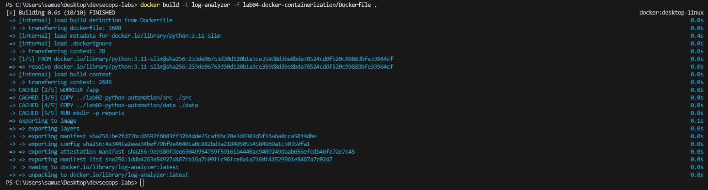
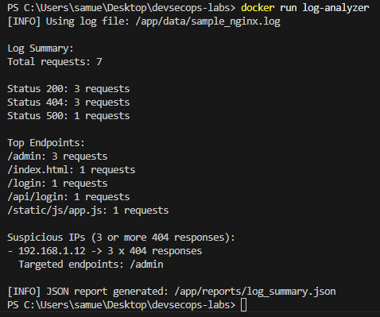
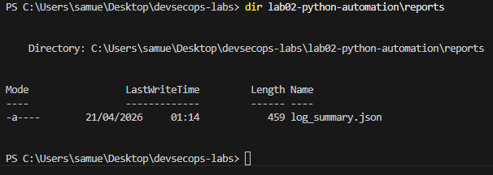
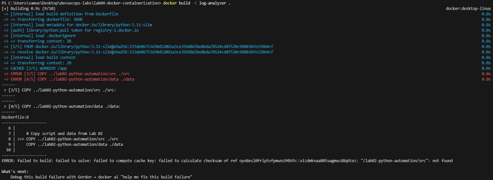

# Lab 04 — Docker Containerization

This lab introduces Docker and demonstrates how to containerize a Python application for consistent and reproducible execution across environments.

---

## Objective

- Containerize the Python log analyzer from Lab 02
- Build and run a Docker image
- Understand Docker build context
- Execute the application inside a container
- Persist output using Docker volumes

---

## What This Lab Does

This lab packages the log analyzer script into a Docker container.

The container:

1. Uses an official Python base image
2. Copies application source code and data
3. Executes the script automatically
4. Generates a JSON report

---

## Project Structure

    devsecops-labs/
    ├── lab02-python-automation/
    └── lab04-docker-containerization/
        ├── Dockerfile
        ├── README.md
        ├── documentation.md
        └── evidences/

---

## Dockerfile Overview

The Dockerfile:

- Uses `python:3.11-slim` as the base image
- Sets `/app` as the working directory
- Copies source code and data from Lab 02
- Creates a reports directory
- Runs the Python script

---

## How to Build the Image

From the repository root:

    docker build -t log-analyzer -f lab04-docker-containerization/Dockerfile .

---

## How to Run the Container

### Basic execution

    docker run log-analyzer

### With volume (recommended)

    docker run -v ${PWD}/lab02-python-automation/reports:/app/reports log-analyzer

This allows the JSON output to be saved on the host machine.

---

## Output

The script generates:

    /app/reports/log_summary.json

When using volumes, the file is stored locally in:

    lab02-python-automation/reports/

---

## Key Concepts Learned

- Docker image creation
- Container execution
- Build context limitations
- File system isolation
- Data persistence using volumes

---

## Evidences

Add screenshots in the `evidences/` folder:

- Docker build success
- Container execution output
- Volume persistence verification
- Build context error (for learning purposes)

---

## Related Labs

- Lab 02 — Python Log Analysis
- Lab 03 — CI/CD Pipeline with GitHub Actions

---

## Evidences

### Docker Build

### Container Execution

### Volume Persistence

### Build Context Error

