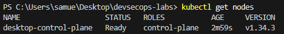
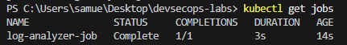
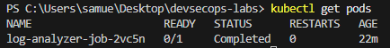
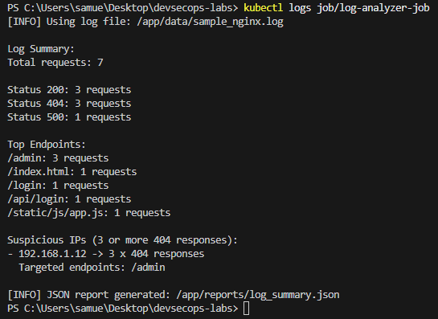
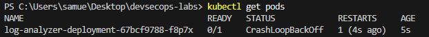

# Lab 05 — Kubernetes Basics

This lab introduces Kubernetes by running a containerized Python application inside a local Kubernetes cluster using Docker Desktop.

---

## Objective

- Understand Kubernetes fundamentals
- Run a containerized application in Kubernetes
- Learn the difference between Deployments and Jobs
- Execute a batch workload
- Retrieve and analyze logs

---

## Overview

In this lab, the log analyzer application (from Lab 02) is executed inside Kubernetes.

Since the application is a **batch process** (it runs and exits), a **Kubernetes Job** is used instead of a Deployment.

---

## 📂 Project Structure

    devsecops-labs/
    ├── lab02-python-automation/
    ├── lab04-docker-containerization/
    ├── lab05-kubernetes-basics/
    │   ├── job.yaml
    │   ├── README.md
    │   ├── documentation.md
    │   └── evidences/

---

## Kubernetes Setup

Kubernetes is enabled through Docker Desktop (single-node cluster).

Verify cluster status:

    kubectl get nodes

---

## How to Run

### 1. Build and push Docker image

    docker build -t log-analyzer -f lab04-docker-containerization/Dockerfile .
    docker tag log-analyzer:latest <your-dockerhub-username>/log-analyzer:latest
    docker push <your-dockerhub-username>/log-analyzer:latest

---

### 2. Run using Kubernetes Job

    kubectl apply -f lab05-kubernetes-basics/job.yaml

---

### 3. Verify execution

    kubectl get jobs
    kubectl get pods

---

### 4. View logs

    kubectl logs job/log-analyzer-job

---

## Output

The application processes a log file and generates a JSON report:

    /app/reports/log_summary.json

Console output includes:

- Total requests
- Status code distribution
- Top endpoints
- Suspicious IPs

---

## Troubleshooting

During the initial implementation, a `CrashLoopBackOff` error occurred when using a Deployment.

This happened because the application is a **batch process that terminates after execution**, while Deployments expect containers to run continuously.

The issue was resolved by switching to a **Kubernetes Job**, which is designed for short-lived tasks.

---

## Evidences

### Kubernetes Cluster Ready

### Job Execution

### Pod Status

### Application Logs

### Troubleshooting (CrashLoopBackOff)

---

## Key Learnings

- Kubernetes cluster basics
- Pods and container lifecycle
- Difference between Deployment and Job
- Handling batch workloads
- Debugging using logs
- Image distribution via Docker Hub

---

## Related Labs

- Lab 02 — Python Log Analysis
- Lab 04 — Docker Containerization
