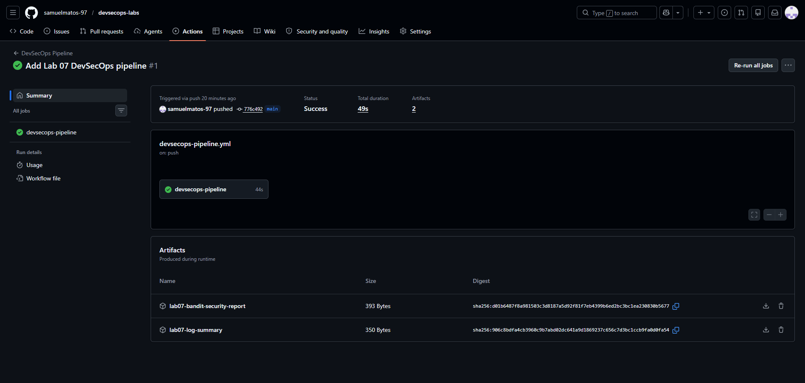
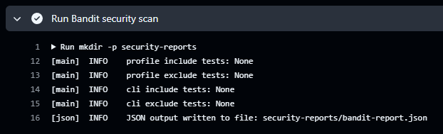
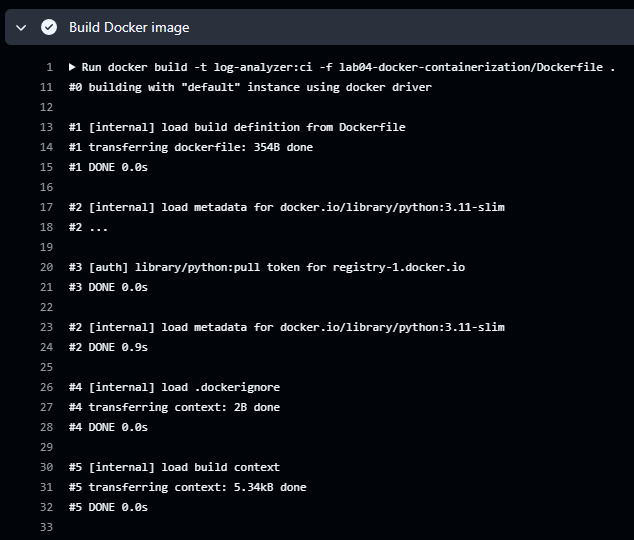
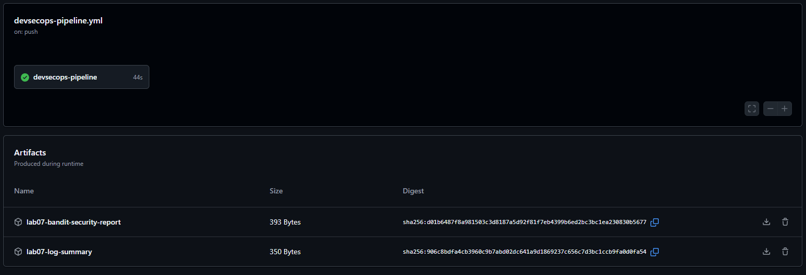

# Lab 07 — DevSecOps Pipeline

This lab demonstrates a complete DevSecOps pipeline using GitHub Actions.

The pipeline integrates:

- Python automation
- Security scanning with Bandit
- Docker image build
- Artifact generation

---

## Objective

- Automate security and validation tasks
- Run static application security testing (SAST)
- Build Docker images automatically
- Generate and store pipeline artifacts
- Understand DevSecOps workflow integration

---

## Pipeline Overview

The GitHub Actions workflow performs the following steps:

1. Checkout repository
2. Configure Python environment
3. Install Bandit
4. Run security scan
5. Execute Python log analyzer
6. Validate generated JSON report
7. Build Docker image
8. Upload artifacts

---

## Project Structure

    devsecops-labs/
    ├── lab02-python-automation/
    ├── lab04-docker-containerization/
    ├── lab07-devsecops-pipeline/
    │   ├── README.md
    │   ├── documentation.md
    │   └── evidences/
    └── .github/
        └── workflows/
            └── devsecops-pipeline.yml

---

## Security Scanning

The pipeline uses:

    Bandit

to perform static security analysis on the Python source code.

The generated report is stored as a pipeline artifact.

---

## Docker Integration

The workflow automatically builds the Docker image using:

    docker build -t log-analyzer:ci -f lab04-docker-containerization/Dockerfile .

This validates the containerization process during CI execution.

---

## Artifacts

The pipeline uploads:

- JSON log analysis report
- Bandit security report

Artifacts generated:

    lab07-log-summary
    lab07-bandit-security-report

---

## Workflow Trigger

The pipeline executes automatically on:

- push
- pull_request

for changes related to:

- Lab 02
- Lab 04
- workflow configuration

---

## Evidences

### Successful Pipeline Execution

### Bandit Security Scan

### Docker Build

### Generated Artifacts

---

## Key Learnings

- GitHub Actions workflow creation
- DevSecOps pipeline integration
- Static security analysis using Bandit
- Automated Docker builds
- Artifact management
- CI/CD automation principles

---

## Related Labs

- Lab 02 — Python Automation
- Lab 03 — CI/CD Pipeline
- Lab 04 — Docker Containerization

---

## Conclusion

This lab demonstrates how DevSecOps practices can be integrated into a CI/CD pipeline using GitHub Actions.

The workflow combines automation, security validation, containerization, and artifact management into a single automated process.
